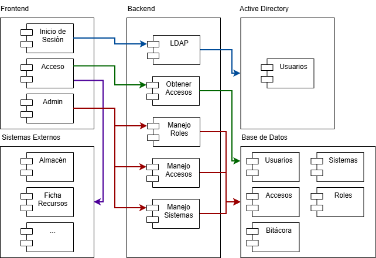

# Arquitectura del Sistema de Inicio de Sesión Centralizado (SSO)
Ministerio de Economía

---

## 1. Visión General

El Sistema de Inicio de Sesión Centralizado (SSO) proporciona autenticación única para todos los sistemas internos del Ministerio de Economía.  
LDAP actúa como directorio de identidad principal, mientras que el SSO gestiona roles, tokens y auditoría.  

---

## 2. Componentes Principales

| Componente                        | Descripción |
|----------------------------------|-------------|
| **SSO (Identity Provider)**       | Motor central de autenticación, emite tokens JWT y valida credenciales contra LDAP. |
| **LDAP Server**                   | Directorio central de usuarios, almacena credenciales y atributos básicos. |
| **Base de Datos SSO**             | Gestiona roles, sesiones, accesos y bitácora de auditoría. |
| **Sistemas Integrados (Service Providers)** | Aplicaciones internas que consumen el SSO. |
| **Servicio de Auditoría**         | Registra eventos de login, logout y cambios en roles/sistemas. |

---

## 3. Tecnología Base

| Capa           | Tecnología |
|----------------|--------------------------|
| Frontend       | Por definir (React)|
| Backend        | Por definir (Node.js, Python) |
| Base de Datos  | Por definir |
| Tokens         | JWT |
| Directorio     | LDAP (Active Directory) |

---

## 4. Diagrama de Arquitectura

---

## 5. Principios de Diseño

1. LDAP como fuente única de identidad.  
2. **Tokens JWT** para comunicación segura entre sistemas.  
3. **Alta disponibilidad** y escalabilidad del SSO y LDAP.  
4. **Auditoría completa** para trazabilidad y cumplimiento normativo.  
5. Separación de responsabilidades entre autenticación, roles y sistemas integrados.