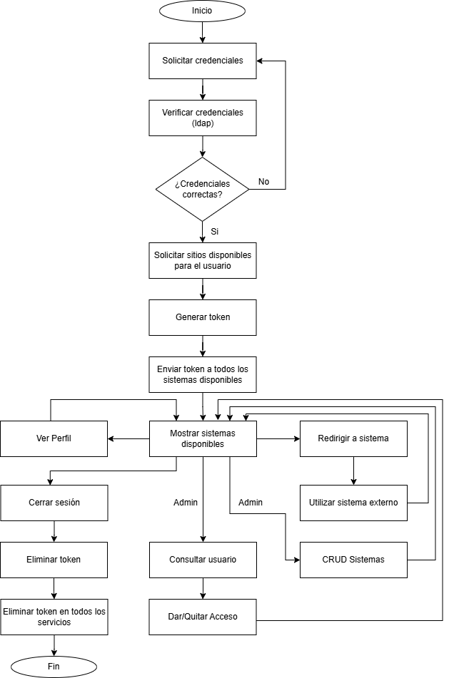

# Flujo del Sistema
Ministerio de Economía

---

## 1. Flujo de Autenticación

El flujo de autenticación permite que un usuario acceda a cualquier sistema integrado al SSO utilizando **LDAP como fuente de identidad** y recibiendo un **token JWT** para acceder a los sistemas.

### Pasos del Flujo
1. El usuario accede a un sistema interno del Ministerio.
2. El sistema redirige al **SSO** para autenticación centralizada.
3. El usuario ingresa su **usuario y contraseña**.
4. El **SSO valida las credenciales** contra el **LDAP**.
5. Si la autenticación es correcta, el SSO genera un **Token**.
6. El sistema comparte el Token con los demas sistemas.
7. El sistema valida la firma del token.
8. El usuario obtiene acceso al sistema.

### Diagrama de Flujo

---

## 2. Flujo de Logout

El logout permite que el usuario cierre sesión de manera centralizada en todos los sistemas integrados.

### Pasos del Flujo de Logout
1. El usuario solicita cerrar sesión desde un sistema.
2. El sistema redirije al SSO.
3. El usuario cierra sesión desde el SSO.
3. El SSO invalida todos los tokens activos asociados al usuario.
4. El usuario queda desconectado de todos los sistemas integrados.

