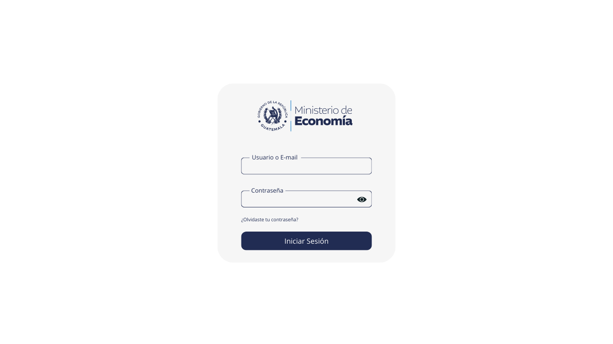
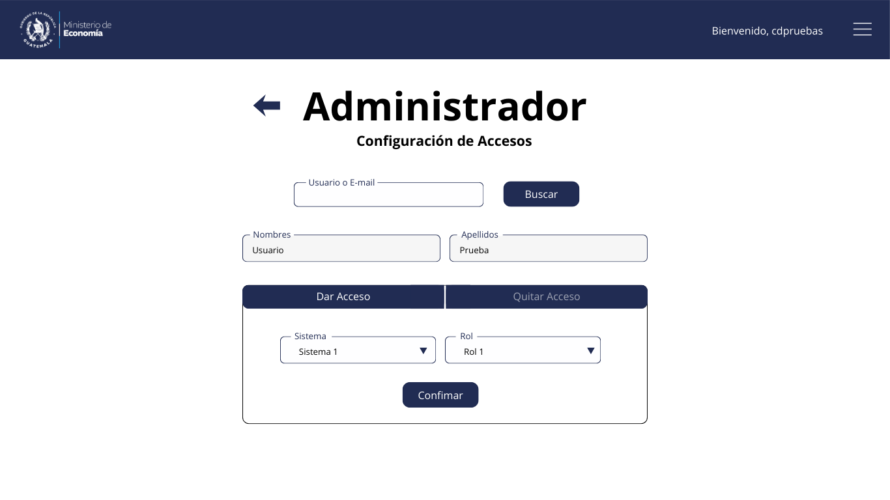
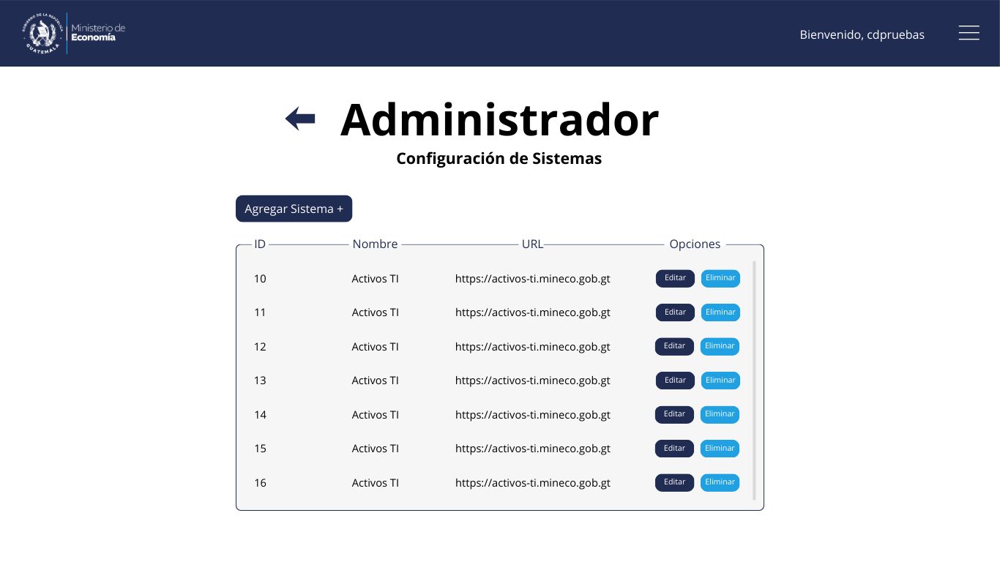
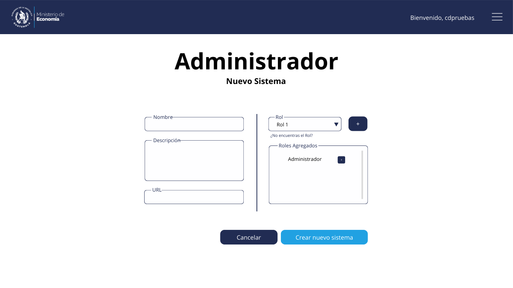
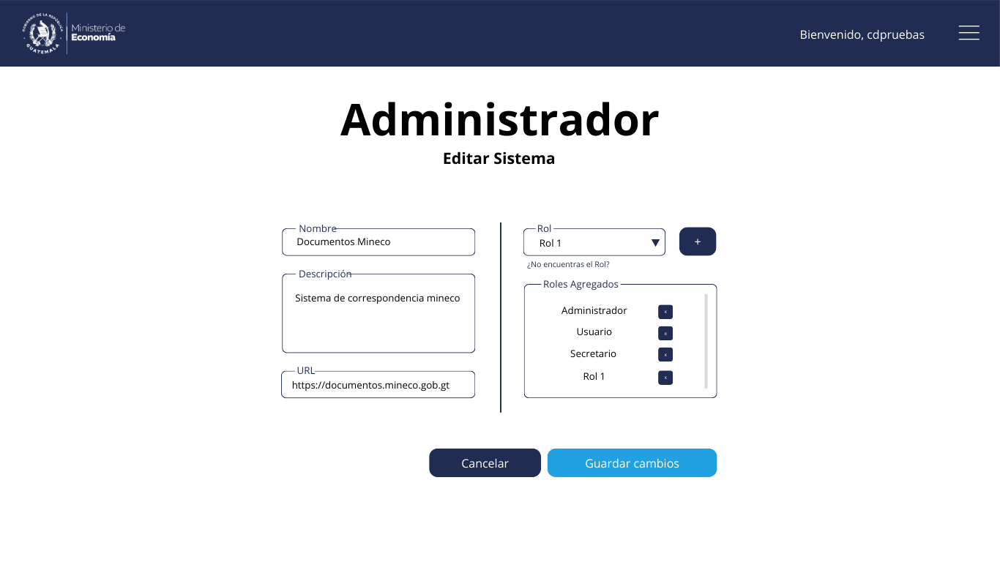
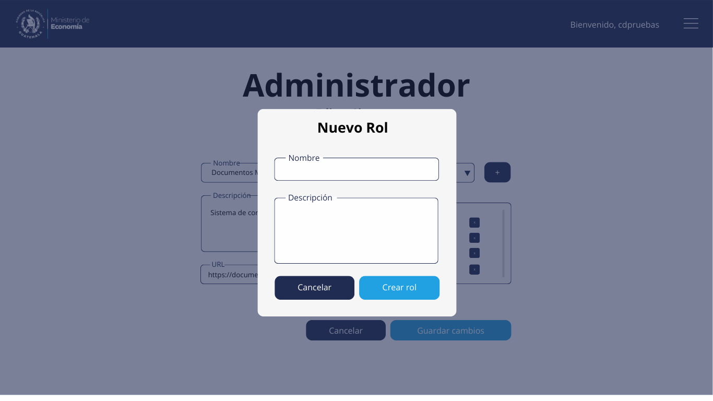

# Mockups
Sistema de Inicio de Sesión Centralizado (SSO)  
Ministerio de Economía

---

## Introducción

Los siguientes mockups representan el diseño conceptual de las principales interfaces del Sistema de Inicio de Sesión Centralizado (SSO).  

Su propósito es visualizar la experiencia de usuario, validar flujos funcionales y servir como guía para la implementación del frontend, manteniendo coherencia con la arquitectura definida.

---

## Inicio de Sesión

Pantalla principal de autenticación del SSO.  
Permite al usuario ingresar sus credenciales institucionales, las cuales son validadas contra el servidor LDAP.  
El diseño prioriza simplicidad, claridad visual y seguridad en la transmisión de datos.

---

## Acceso

Pantalla posterior a la autenticación exitosa.  
Confirma el acceso a los diferentes sistemas y establece la sesión activa mediante el token JWT emitido por el SSO.

---

## Menú Lateral

Componente principal de navegación del sistema.  
Permite acceder a las diferentes funcionalidades del SSO según el rol asignado al usuario, garantizando control de acceso basado en permisos.

---

## Mi Perfil

Sección donde el usuario puede visualizar su información básica y consultar sus roles asignados dentro del SSO.  
Las credenciales no pueden modificarse desde esta vista, ya que son gestionadas exclusivamente en LDAP.

---

## Menú Administrador

Vista exclusiva para usuarios con rol administrativo.  
Proporciona acceso a funcionalidades avanzadas como gestión de roles y sistemas.

---

## Configuración de Accesos

Módulo destinado a la asignación y administración de roles a usuarios y sistemas.  
Permite gestionar permisos de manera centralizada, asegurando trazabilidad y control institucional.

---

## Configuración de Sistemas

Sección para la administración de los sistemas integrados al SSO.  
Incluye visualización de sistemas registrados y configuración general.

---

## Nuevo Sistema

Formulario para el registro de un nuevo sistema cliente dentro del SSO.  
Permite definir información clave como nombre del sistema, descripción, `url` y parámetros necesarios para la integración.

---

## Editar Sistema

Pantalla para la actualización de configuraciones de un sistema previamente registrado.  
Permite mantener consistencia técnica y administrativa en las integraciones.

---

## Nuevo Rol

Formulario para la creación de nuevos roles dentro del SSO.  
Facilita la definición de permisos asociados, permitiendo un modelo de control de acceso flexible, escalable y alineado con las políticas institucionales.